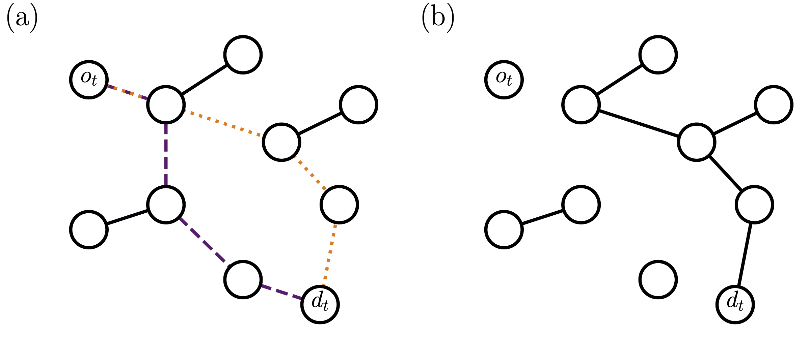

---

##### Download

+ [Paper](main.pdf)
+ [Supplementary Material](supplementary.pdf)
+ [Preprint](https://arxiv.org/abs/2402.06753)
+ [Code and data](https://github.com/danielhankim/shortest-path-percolation)

---

##### Abstract

We propose a bond-percolation model intended to describe the consumption, and eventual exhaustion, of resources in transport networks. Edges forming minimum-length paths connecting demanded origin-destination nodes are removed if below a certain budget. As pairs of nodes are demanded and edges are removed, the macroscopic connected component of the graph disappears, i.e., the graph undergoes a percolation transition. Here, we study such a shortest-path-percolation transition in homogeneous random graphs where pairs of demanded origin-destination nodes are randomly generated, and fully characterize it by means of finite-size scaling analysis. If budget is finite, the transition is identical to the one of ordinary percolation, where a single giant cluster shrinks as edges are removed from the graph; for infinite budget, the transition becomes more abrupt than the one of ordinary percolation, being characterized by the sudden fragmentation of the giant connected component into a multitude of clusters of similar size.

---

##### Schematic Diagram of the Shortest-path percolation model



---

##### Citation

M. Kim and F. Radicchi, Shortest-path percolation on random networks, *Physical Review Letters* **133**, 047402 (2024).

```latex
@article{PhysRevLett.133.047402,
  title = {Shortest-Path Percolation on Random Networks},
  author = {Kim, Minsuk and Radicchi, Filippo},
  journal = {Phys. Rev. Lett.},
  volume = {133},
  issue = {4},
  pages = {047402},
  numpages = {5},
  year = {2024},
  month = {Jul},
  publisher = {American Physical Society},
  doi = {10.1103/PhysRevLett.133.047402},
  url = {https://link.aps.org/doi/10.1103/PhysRevLett.133.047402}
}
```

---

##### Related material

<!-- + [Presentation slides](presentation1.pdf)
+ [Summary of the paper](https://www.penguinrandomhouse.com/books/110403/unusual-uses-for-olive-oil-by-alexander-mccall-smith/) -->
