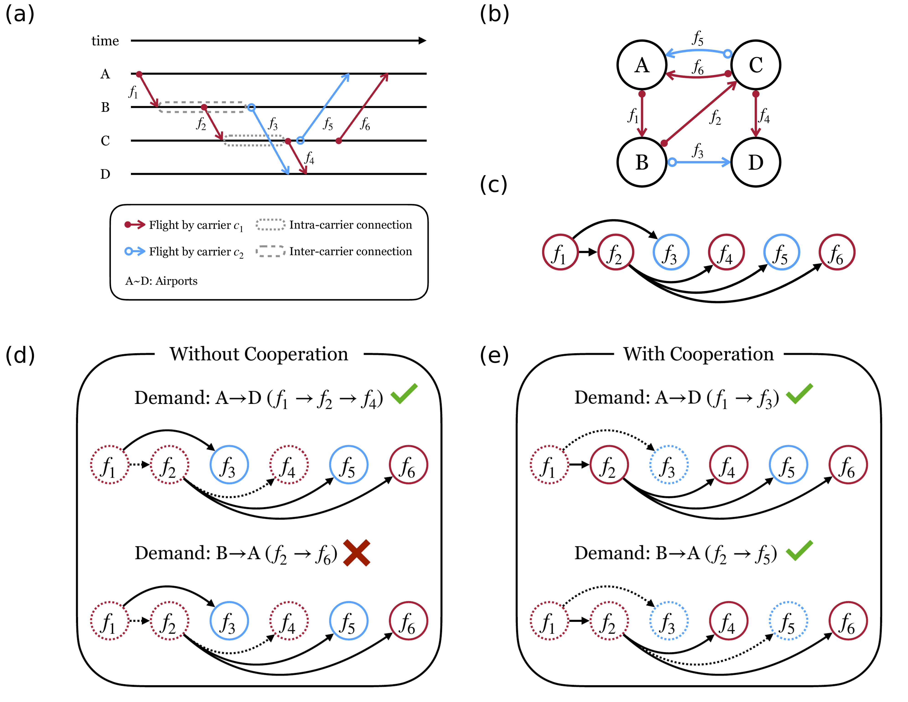

---

##### Download

+ [Paper](https://doi.org/10.1038/s41467-025-63489-w)
+ [Preprint](https://arxiv.org/abs/2504.04245)
+ [Code and data](https://github.com/danielhankim/minimum-cost-percolation-us-airline)

---

##### Abstract

We present a dynamic percolation framework for studying resource depletion in transportation networks. Agents consume network edges along cost-optimal paths, causing the system to transition from functional to non-functional states. Applied to the US air transportation system, the analysis reveals that unrestricted carrier cooperation could yield a 30% efficiency increase compared to the non-cooperative scenario. While requiring major airlines to share market portions, such arrangements would enhance system resilience to disruptions like flight cancellations. The findings suggest code-sharing agreements could provide substantial benefits without modifying operational costs.

---

##### Schematic Diagram of the Minimum-cost Percolation Model



---

##### Citation

M. Kim, C. T. Diggans, and F. Radicchi, "Modeling resource consumption in the US air transportation system via minimum-cost percolation," *Nature Communications* **16**, 8105 (2025).

```latex
@article{kim2025modeling,
  title = {Modeling resource consumption in the {US} air transportation system via minimum-cost percolation},
  author = {Kim, Minsuk and Diggans, C. Tyler and Radicchi, Filippo},
  journal = {Nature Communications},
  volume = {16},
  pages = {8105},
  year = {2025},
  doi = {10.1038/s41467-025-63489-w},
  url = {https://doi.org/10.1038/s41467-025-63489-w}
}
```
