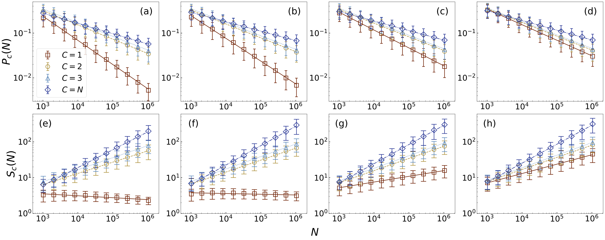

---

##### Download

+ [Paper](main.pdf)
+ [Supplementary Material](supplementary.pdf)
+ [Preprint](https://arxiv.org/abs/2509.09142)
+ [Code and data](https://github.com/danielhankim/shortest-path-percolation-on-scale-free-networks)

---

##### Abstract

We examine how scale-free networks lose connectivity when edges are systematically removed based on shortest-path distances between randomly selected node pairs. Using a budget parameter to control whether paths are eliminated, we conduct large-scale simulations on scale-free networks with power-law degree distributions. We find that the percolation transition is identical to the one observed on Erdős–Rényi networks, denoting independence from the degree exponent. A key discovery is that the removal process drastically homogenizes the heterogeneous structure of scale-free networks before the shortest-path percolation transition takes place, distinguishing finite and infinite budget scenarios.

---

##### Estimation of the Critical Exponents of the SPP on Scale-free Networks



---

##### Citation

M. Kim, L. Cirigliano, C. Castellano, H. Sun, R. Jankowski, A. Poggialini, and F. Radicchi, "Shortest-path percolation on scale-free networks," *Physical Review E* **113**, 014314 (2026).

```latex
@article{PhysRevE.113.014314,
  title = {Shortest-path percolation on scale-free networks},
  author = {Kim, Minsuk and Cirigliano, Lorenzo and Castellano, Claudio and Sun, Hanlin and Jankowski, Robert and Poggialini, Anna and Radicchi, Filippo},
  journal = {Phys. Rev. E},
  volume = {113},
  pages = {014314},
  year = {2026},
  doi = {10.1103/PhysRevE.113.014314},
  url = {https://journals.aps.org/pre/abstract/10.1103/PhysRevE.113.014314}
}
```
